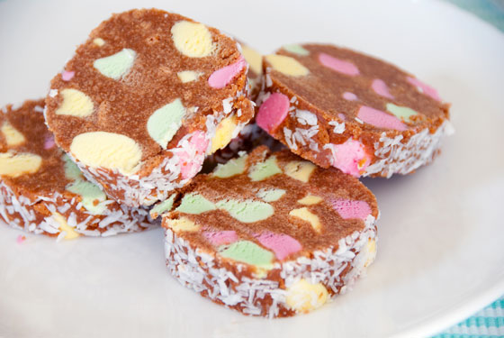

# Lollie cake

Some may argue it is called lollie log, others that it is called Eskimo log, but all will agree that lollie cake is a Kiwi favourite everywhere you go in New Zealand! 

**Ingredients**

* 250g malt biscuits - crushed
* 190g bag of Explorer lollies \(previously known as Eskimo lollies\)
* 1/2 can of sweetened condensed milk
* 1/2 - 3/4 cup desiccated coconut
* 120g butter, melted

**Method** 

1. Crush or process the biscuits to fine crumbs and place in a mixing bowl.
2. Melt the butter and condensed milk in a pot or in the microwave
3. Cut the Explorer lollies into thirds and add to the biscuits, along with the melted butter and condensed milk. Mix as best you can, then turn onto a clean board or sheet of baking paper and form into a log.
4. Roll the log in coconut, and refrigerate for several hours until firm. Serve in slices.

