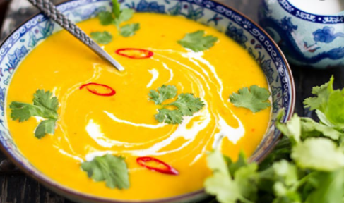

# Thai Pumpkin Soup

## STEP 1

Heat the oil in a large saucepan over medium heat. Add the onion and cook, stirring, for 5 mins or until onion softens. Add pumpkin, carrot and curry paste and cook, stirring, for 2 mins or until aromatic. Add stock and increase heat to high. Bring to the boil. Reduce heat to medium-low. Cook, partially covered, for 30 mins or until pumpkin and carrot are tender. Set aside to cool slightly.

## STEP 2

Use a stick blender to carefully blend the pumpkin mixture until smooth. Reserve 1/4 cup \(60ml\) of the coconut milk. Add the remaining coconut milk to the pumpkin mixture with the lime juice, fish sauce and brown sugar. Stir to combine.

## STEP 3

Ladle soup evenly among serving bowls. Drizzle with reserved coconut milk. Season to serve. 

Want more heat? Try using red curry paste instead of yellow curry paste.

**Serve with** coriander sprigs, toasted coconut flakes and chilli sauce

source: Coles

