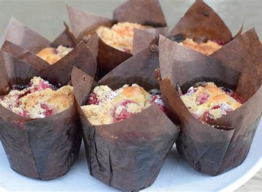

# Rasberry Muffins

## Ingredients

* 2 cups SR FLour
* Small pinch of salt
* 90g unsalted butter - melted
* 3/4 cup caster sugar
* 2tsp vanilla paste
* 2 eggs
* 1/2 cup thickened cream
* 11/2 cups fresh rasberries

### Instructions

1. Preheat oven tp 180c
2. Prepare jumbo muffin tin with 6 liners
3. Whisk together the flour, sugar and salt in a bowl
4. In another bowl add eggs, cream, vanilla paste and melted butter and mix until combined
5. Add dry ingredients and mix until just combined
6. Fold berries in to the batter, with 2-3 gentle stirs
7. Divide in to the muffin liners
8. Bake for  approx 25 mins - should be golden brown on top
9. Enjoy!

